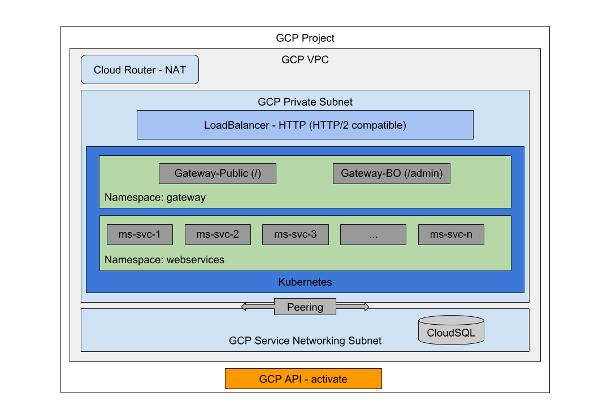
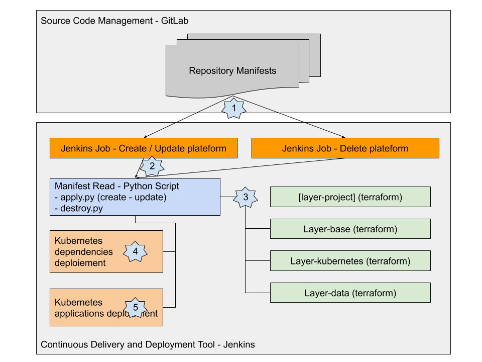
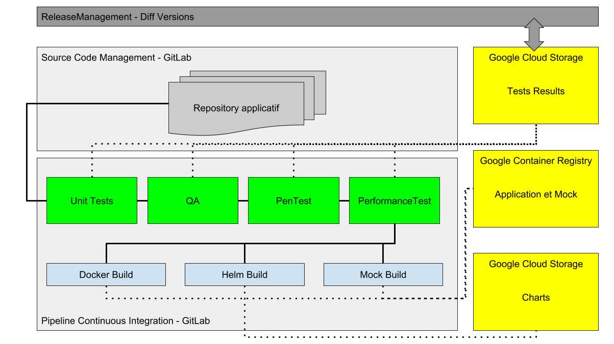
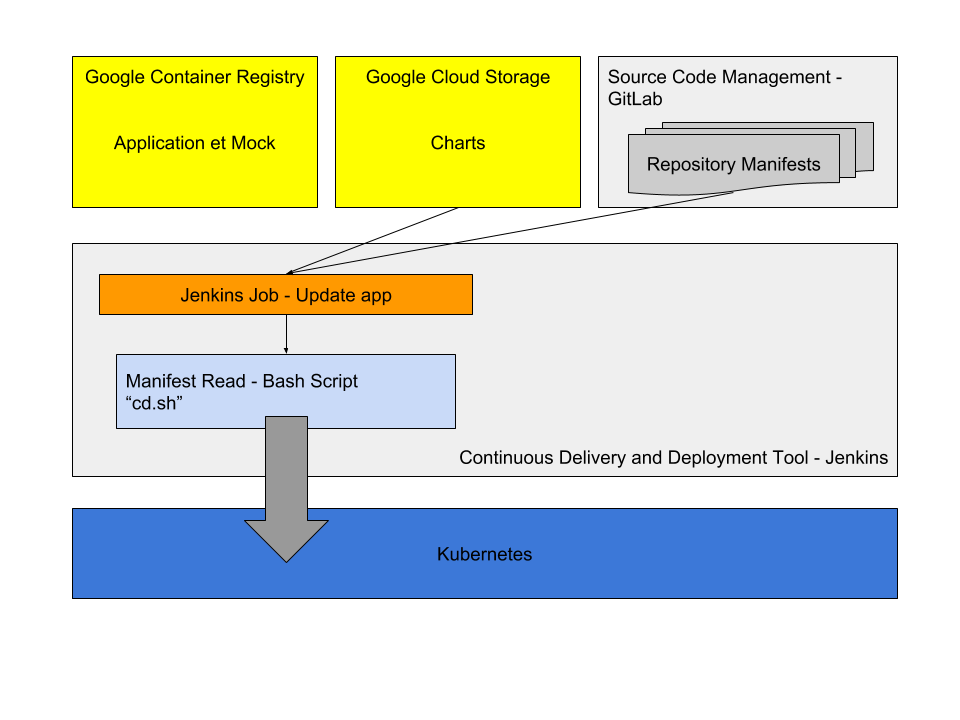

# POC WeScale

## Prérequis

- Terraform v0.11
- Python 3.6
- Gcloud
- kubectl

### Installation des dépendances Python

Aller dans le répertoire "iac", puis lancer la commande suivante:

```language-bash
pip install -r requirements.txt
```

## Structure du repository

Dans ce repository git vous trouverez la structure suivante:

- **"app"**: l'application simple en Go permettant de tester cette infrastructure et son outillage de CI/CD
  - **"src"**: code source de l'application
  - **"app-chart"**: chart Helm permettant de déploiement de l'application
  - **"static"**: une dépendance static de la stack à déployer
  - **"ci.sh"** et **"cd.sh"**: les scripts à lancer par l'usine
- **"docs"**: reprend la documentation explicative de ce POC et du workshop
- **"iac"**: le code pour la création de l'infrastructure (Terraform + Kubernetes)
  - **"kubernetes"**: installation des dépendances de Kubernetes
  - **"scripts"**: des scripts bash pour des besoins spécifiques
  - **"terraform"**: contient l'ensemble des layers Terraform
- **"plateform"**: un exemple de manifest d'une plateforme

## Architecture



Quelques points importants de cette infrastructure:

- Kubernetes est dans un réseau privé pour les nodes et en public pour les masters. Voir [docs/gke](docs/gke.MD)
- le routeur NAT permet aux instances Kubernetes isolé dans un subnet "privé" et sans adresse IP publique de pouvoir atteindre des cibles réseaux sur Internet. (GCR, webservice extérieur, ...)
- le LoadBalancer doit ici être de type "HTTP" pour pouvoir acceter les appels gRPC voir [docs/http-loadbalanceur](docs/http-loadbalanceur.MD)
- l'instance Cloud SQL est gérée via un Peering voir [/docs/cloud-SQL](docs/cloud-SQL.MD)

## IaC



Le principe de cette infrastructure est de décrire l'infrastructure dans un "manifest" en YAML.

C'est cette description qui permettra de configurer chaque plateforme en fonction des besoins.

### Les layers Terraform

Depuis ce layer l'IaC appel des layers Terraform. [Article sur les layers](https://blog.wescale.fr/2017/06/12/terraform-layering-pourquoi-et-comment/)

Les layer permettent de créer l'infrastructure dans GCP.

Chaque layer a un certain nombre d'entrées via des variables ou la possibilité de récupérer les variables de sortie des autres layers.

Chaque layer met à disposition des variables pour d'autres layer ou pour être récupérer via un script.

### Les workspaces Terraform

C'est l'outils de parralélisation des plateformes. Pour chaque plateforme correspond un workspace Terraform.
La création d'un workspace nous met à disposition:

- une variable ${terraform.workspace} permettant de suffixer les objets GCP
- la gestion d'un tfstate par workspace dans le backend de stockage des layers (ici GCS)

### Manifest

Le manifest décrit une platefome et permet d'appeler les éléments d'IaC à partir d'un fichier unique.

Pour aller plus loin avec le manifest: [docs/manifest.MD](docs/manifest.MD)

#### Limitations connues

- seuleument 4 addresses IP sont possible dans la liste des IPs autorisées
- uniquement en /32 pour le moment
- la derniere IP ajouté est l'IP public utilisé par ce script

### layer-project

Ce layer est le seul à ne pas être exécuté à chaque création de plateforme.

Il permet d'activer les différents services GCP à la création d'un nouveau GCP Project.

### layer-base

Dans ce layer les éléments suivants sont créés:

- VPC
- Subnet
- Router NAT
- Private DNS
- Peering vers "servicenetworking.googleapis.com" pour CloudSQL
- Service account

### layer-kubernetes

Dans ce layer les éléments suivants sont créés:

- Kubernetes via Google Kubernetes Engine voir [docs/gke](docs/gke.MD)
- LoadBalanceur HTTP voir [docs/http-loadbalanceur](docs/http-loadbalanceur.MD)
- Bucket dans GCS pour les fichiers statiques de l'application

### layer-data

Dans ce layer les éléments suivants sont créés:

- PubSub Topic
- PubSub Subscription
- CloudSQL
- Création d'un Record DNS dans la zone privé DNS de GCP

Attention: l'utilisation de CloudSQL nécessite la génération d 'un numéro unique pour la BDD. Il faut que le job de création d'infrastructure puisse commiter & pusher le manifest dans son repos.

### Kubernetes dépendances

Pour Kubernetes il faut installer:

- Helm (Tiller) pour l'installation d'applications
- CertManager pour la gestion des certificats

## Continuous Integration



Le schéma final avec l'ensemble des étapes du pipeline de Build.
Quelques explications ci dessous qui décrive ce fichier [app/ci.sh](app/ci.sh)

### tests

Les tests ne faisaient pas partie du périmètre de ce POC.
Il faudra les ajouter par la suite.

Un test à minima qui peut être mis en place pour tester le packaging Helm est l'exécution de ces commandes.

```language-bash
helm install --dry-run --debug ./app/app-chart
helm lint ./app/app-chart
```

### compilation

```language-bash
docker build -t eu.gcr.io/slavayssiere-sandbox/app:$version ./app/src/
```

### envoie dans GCR

```language-bash
docker push eu.gcr.io/slavayssiere-sandbox/app:$version
```

### packaging Helm

```language-bash
helm package --version $version ./app/app-chart
gsutil mv app-chart-$version.tgz gs://charts-wescale-sandbox/app-chart/$version/app-chart-$version.tgz
```

## Continuous Delivery



L'objectif de cette étape est de déployer une application dans une plateforme.

Pour cela il est possible d'utiliser:

- l'update de la plateform via le manifest et le job Jenkins générique
- un job dédié à cette fonction et qui peut exécuter le script [app/cd.sh](app/cd.sh)

### upgrade via Helm

Il faut commencer par télécharger le Chart depuis GCS puis mettre à jour.

```language-bash
gsutil cp gs://charts-wescale-sandbox/app-chart/$version/app-chart-$version.tgz app-chart-$version.tgz
helm upgrade test-app app-chart-$version.tgz --set image.tag=$version
```

Il est également possible d'utiliser un outil de type ["Keel"](https://keel.sh/) pour mettre en place cette étape.

### déploiement des statics

```language-bash
gsutil cp static/LP-Box.svg gs://lp-static-bucket-dev-seb/image.svg
```

## Continuous Deployment

Le pipeline de continous deployment ne fait pas partie de ce POC.

Pour avoir une bonne vision sur la release, il faut réaliser les étapes suivantes:

- tests d'intégration
- tests de performances
- pen tests

chacun de ces tests doit archiver ses résultats dans le repertoire GCS utilisé par le pipeline de CI.

Avant un passage en production le release manager doit comparer le résultat de tout ces tests pour prendre une décision.
Des scripts peuvent être mis en place pour aider à la prise de décision. (comparaison release précédent/après)

## Pour lancer ce POC

### si besoin après création du GCP Project

```language-bash
cd iac/terraform/layer-project
./apply.sh
```

### dans tous les cas

```language-bash
cd iac
python apply.py
```

Renseigner le nom du fichier, ici "dev-2"

A la fin pour tester la connexion à CloudSQL:

```language-bash
NOM_PF="dev-3"
PASSWORD="$(kubectl -n webservices get secrets cloudsql-secrets-user1 -o=jsonpath='{.data.password}' | base64 --decode)"
kubectl run mysql-client --image=mysql:5.7 -it --rm --restart=Never -- mysql -h bdd.$NOM_PF.internal.lp -uuser1-$NOM_PF -p$PASSWORD
```

### Suppression

```language-bash
cd iac
python destroy.py
```

Renseigner le nom du fichier, ici "dev-2"

## Reste à faire

- CloudFunction
- Monitoring des plateformes
- installation de CertManager

- Changer le healthcheak vers le default app vers Traefik (public): /ping et 31080
